#  1. Основные понятия и определения электрических цепей. Классификация цепей. Элементы цепи. Схема замещения, топология цепей.          

- **Электрической цепью** называется совокупность устройств и объектов, образующих путь для электрического тока, электромагнитные процессы в которых могут быть описаны с помощью понятий об электрическом токе, ЭДС (электродвижущая сила) и электрическом напряжении.
- Для расчета и анализа реальная электрическая цепь представляется графически в виде расчетной электрической схемы (схемы замещения), содержащей условные обозначения ее элементов и способы их соединения.
- Все устройства и объекты, входящие в состав электрической цепи, могут быть разделены на три группы:

  1) Источники электрической энергии (питания) показывается как источник ЭДС E с внутренним сопротивлением r0.
  2) Потребители электрической энергии заменяются их электрическими параметрами: активными сопротивлениями R1, R2,…,Rn.
  3) Вспомогательные элементы цепи: соединительные провода, коммутационная аппаратура, аппаратура защиты, измерительные приборы и т.д., без которых реальная цепь не работает.
   
- При расчете в схеме электрической цепи выделяют несколько основных элементов:
  - *Ветвь электрической цепи (схемы)* – участок цепи с одним и тем же током. Ветвь может состоять из одного или нескольких последовательно соединенных элементов.
  - *Узел электрической цепи (схемы)* – место соединения трех и более ветвей. 
  - *Контур* – любой замкнутый путь, проходящий по нескольким ветвям.

  
#  2. Пассивные и активные элементы схем замещения (определения, примеры).

- Все электрические цепи делятся на линейные и нелинейные.
  - Элемент электрической цепи, параметры которого (сопротивление и др.) не зависят от тока в нем, называют линейным, например электропечь.
  - Нелинейный элемент, например лампа накаливания, имеет сопротивление, величина которого увеличивается при повышении напряжения, а следовательно и тока, подводимого к лампочке.

# 3. Последовательное и параллельное соединение резисторов.

- Последовательное соединение 
  $$ R = R_1+R_2+R_3+\ldots $$

- Параллельным называют такое соединение, при котором все включенные в цепь потребители электрической энергии, находятся под одним и тем же напряжением
  $$ R = (\frac{1}{R_1}+\frac{1}{R_2}+\ldots)^{-1} \\ \frac{I_1}{I_2} = \frac{R_2}{R_1} $$

#  4. Преобразование соединения резисторов треугольником в эквивалентную звезду.

#  5. Преобразование соединения резисторов звездой в эквивалентный треугольник.

#  6. Идеальный и реальный источник ЭДС. Свойства, нагрузочная характеристика.

- Идеальный источник ЭДС – активный элемент, напряжение на выводах  которого не зависит от тока через него, так как его внутреннее сопротивление r0 = 0.
- Уравнение внешней (нагрузочной) характеристики $U_{ab} = E–r_0I_Н = r_Н I_Н$, как правило,  $r_0 <<  r_Н$.
- 
  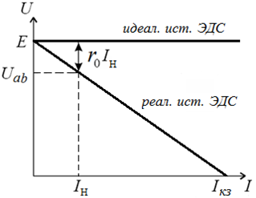

#  7. Идеальный и реальный источник тока. Свойства, нагрузочная характеристика.

- Идеальный источник тока (ИТ)– активный элемент, ток которого не зависит   от напряжения на его выводах, так как его внутреннее сопротивление $r_0 = \infty$.
- Уравнение внешней (нагрузочной) характеристики $I_Н =J–I_0=J–g_0U_{ab}$, как правило,  $r_0=1/g_0 >> r_Н$
- 
  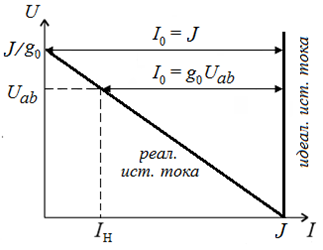

#  8. Взаимные эквивалентные преобразования источников ЭДС и тока.

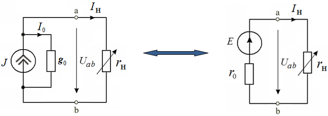

- *Условие эквивалентности*: ток и напряжение на нагрузке неизменны.
- При сравнении внешних характеристик ИТ и ЭДС видно, что они одинаково реагируют на изменение величины сопротивления нагрузки.

#  9. Последовательное и параллельное соединение источников ЭДС.

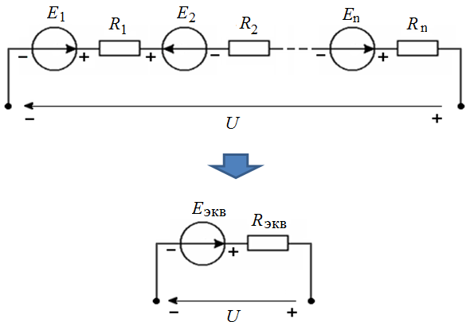

$$ E_{total} = E_1-E_2+\ldots+E_n \quad R_{total} = \sum^n R_n$$

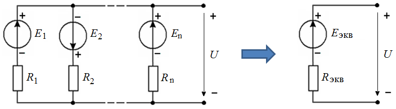
$$ E_{total} = \frac{\frac{E_1}{R_1}+\frac{E_2}{R_2}+\ldots}{\frac{1}{R_1}+\frac{1}{R_2}+\ldots}=\frac{J_1+J_2+\ldots}{G_1+G_2+\ldots}=\frac{J_{total}}{G_{total}}$$

#  10. Параллельное и последовательное соединение источников тока.

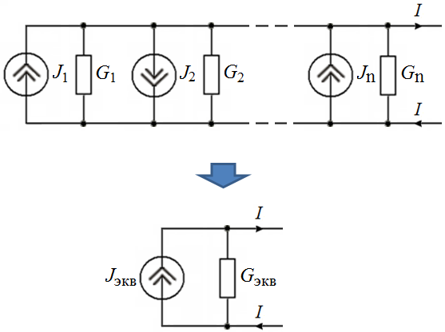

$$ J_{экв} = J_1- J_2 + … + J_n \quad    G_{экв} = G_1+G_2+… +G_n$$
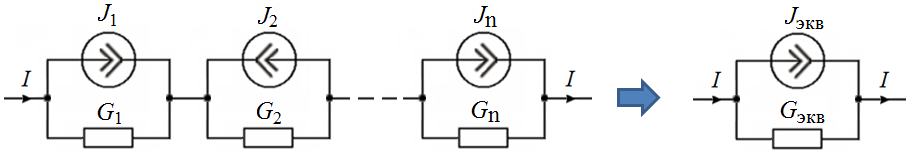

$$ J_{total} = \frac{\frac{J_1}{G_1}+\frac{J_2}{G_2}+\ldots}{\frac{1}{G_1}+\frac{1}{G_2}+\ldots}=\frac{E_1+E_2+\ldots}{R_1+R_2+\ldots}=\frac{E_{total}}{R_{total}}$$

#  11. Пассивные и активные двухполюсники. Схемы замещения. Вольт-амперная (нагрузочная) характеристика линейного активного двухполюсника. Режимы работы активного двухполюсника (на характеристике).

- Реальная электрическая цепь может быть представлена в виде соединения активного и пассивного двухполюсников
- Двухполюсником называют цепь, которая соединяется с внешней относительно нее частью цепи через два вывода а и b – полюса.
- Активный двухполюсник содержит источники электрической энергии, пассивный  - не содержит.
- Схема замещения и вольт-амперная характеристика линейного пассивного двухполюсника
  
  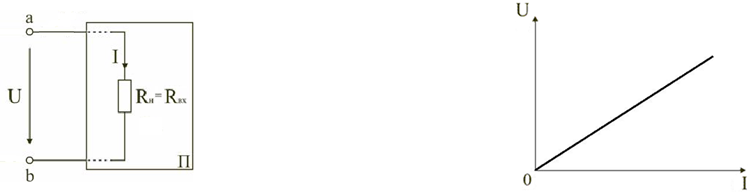

  $$ R_{xx} = \frac{U}{I}$$

- Работа активного двухполюсника под нагрузкой  Rн определяется его вольт-амперной (нагрузочной, внешней) характеристикой:
  $$ U = E_{Э} - Ir_0$$

- Строится по двум точкам: 1 (холостой ход) и 2 (короткое замыкание).

	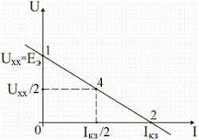

#  12. Режим холостого хода и короткого замыкания активного двухполюсника. Определение параметров активного двухполюсника (Uхх, Iкз, Rэ).

- Режимы работы активного двухполюсника:
  1. холостой ход – нагрузка отключается от источника ЭДС, Rн=∞, ток в нагрузке I=0, напряжение на зажимах ab становится равным ЭДС  Eэ и называется напряжением холостого хода Uхх (т. 1)
   $$ U = E_{э} - Ir_0 = E - 0*r_0 = E = U_{xx}$$
  2. короткое замыкание  – сопротивление Rн=0, напряжение U=0, ток становится равным току короткого замыкания IКЗ (точка 2).
   $$ 0 = E-Ir_0 \Rightarrow I=\frac{E}{r_0} = I_{кз}$$
  3. номинальный – обеспечивает параметры, указанные в технической документации. Все элементы цепи работают в расчетном режиме: ток в нагрузке равен Iном , напряжение - Uном , мощность - Рном (т. 3):
   $$ U_{ном} = Eэ_ - I_{ном}r_0  \\
		Р_{ном} = U_{ном} I_{ном} $$
  4. согласованный

- Параметры активного двухполюсника Eэ и r0 могут быть определены по результатам режимов холостого хода и короткого замыкания:
  $$ E_э = U_{хх}  \quad r_0 = U_{хх} / I_{кз}$$

При изменении тока в пределах 0 ≤ I ≤ Iкз двухполюсник  отдает энергию во внешнюю цепь (участок I вольт-амперной характеристики). Пример: аккумулятор разряжается на нагрузку.

При I< 0 и U>Uхх (участок II) источник получает энергию из внешней цепи, т.е. к зажимам аb двухполюсника присоединена внешняя цепь с источником питания

– аккумулятор заряжается от зарядного устройства.

При напряжении U< 0 (обратная полярность внешнего источника, ток I > Iкз ) резисторы двухполюсника потребляют энергию внешней цепи и самого активного двухполюсника (участок III) – к аккумулятору подключили источник (другой аккумулятор)  в обратной полярности.

#  13. Согласованный режим работы активного двухполюсника.

- Согласованный режим – режим передачи максимальной мощности от источника к приемнику.

ток в нагрузке  I = Eэ /(r0 + Rн);

мощность, выделяемая в нагрузке $Р_н = I^2 R_н  = [E_э^2/(r_0 + R_н)^2 ]R_н$

Можно показать, что при r0= Rн  мощность будет максимальна $Р_н\text{ max} = R_н(E_э/2R_н)^2  = E_э^2/4R_н$

#  14. КПД активного двухполюсника. КПД в согласованном режиме.

Мощность, выделяемая в нагрузке $Р_н = IU_н = I^2 R_н$

Полная мощность источника ЭДС $Р_Е = E_эI = I^2 (R_н+ r_0)$

КПД  $η = Р_н /Р_Е = R_н/(R_н+ r0) = 1 - r_0 I/E_э$

При двух предельных значениях сопротивления нагрузки Rн= 0 и Rн= ∞ мощность, выделяемая в нагрузке Рн = 0

КПД в согласованном режиме $(r_0 = R_н) η = R_н/(R_н+ r_0) = 0,5$

#  15. Законы Ома (для участка цепи постоянного тока, замкнутой цепи, активной ветви).

- Закон Ома для участка цепи
  $$ I = \frac{U_R}{R} \quad U_R=IR$$

При расчете электрических цепей иногда удобнее пользоваться не сопротивлением R, а величиной обратной сопротивлению, т.е. электрической проводимостью: 

$$ g=\frac{1}{R} = \frac{I}{U} $$

В этом случае закон Ома для участка цепи запишется в виде:

$$ I=Ug$$

- Закон Ома для всей цепи
  $$ I = \frac{E}{R} = \frac{E}{R_l+r_0}$$

- Обобщенный закон Ома (закон Ома для активной ветви)

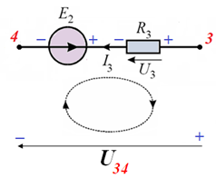

Для получения выражения для тока можно использовать:

1) соотношения между потенциалами точек ветви
	$$ U_{34} = U_3+E_2 $$
  $$ U_{34} = I_3R_3+E_2 $$
  $$ I_3 = \frac{(U_{34}-E_2)}{R_3}$$
2) по II закону Кирхгофа для контура
   	$$ U_{34} - U_3 = E_2 \quad || \quad U_{34} = U_3+E_2$$

#  16. 1-й и 2-й законы Кирхгофа для цепей постоянного тока.

- *Первый закон Кирхгофа* - в любом узле электрической цепи алгебраическая сумма токов равна нулю
  $$ \sum_{k=1}^{m}I_k=0$$
- *Второй закон Кирхгофа* - В любом замкнутом контуре электрической цепи алгебраическая сумма ЭДС равна алгебраической сумме падений напряжений на всех его участках
  $$ \sum_{k=1}^{n}E_k=\sum_{k=1}^{m}R_kI_k=\sum_{k=1}^{m}U_k$$
Если в электрической цепи включены источники напряжений, то второй закон Кирхгофа формулируется в следующем виде: алгебраическая сумма напряжений на всех элементах контру, включая источники ЭДС равна нулю
  $$ \sum_{k=1}^{m}U_k = 0$$
При записи уравнений по второму закону Кирхгофа необходимо:

1) задать условные положительные направления ЭДС, токов и напряжений;

2) выбрать направление обхода контура, для которого записывается уравнение;

3) записать уравнение, пользуясь одной из формулировок второго закона Кирхгофа, причем слагаемые, входящие в уравнение, берут со знаком «плюс», если их условные положительные направления совпадают с обходом контура, и со знаком «минус», если они противоположны.

#  17. Расчет цепей постоянного тока методом эквивалентных преобразований пассивных элементов и методом пропорциональных величин.

- Метод эквивалентных преобразований источников энергии: используя способы последовательного и параллельного соединения источников ЭДС и тока, выполняется свертка  исходной схемы до одного эквивалентного источника ЭДС или тока и резистора с эквивалентным сопротивлением. 
  - В первом случае вычисляется ток через эквивалентный источник ЭДС
  - во втором - напряжение на выводах эквивалентного источника тока. 
  - Далее последовательно находятся напряжения между узлами и токи в ветвях схемы, при это достаточно использования закона Ома и 1-го закона Кирхгофа для токов в узлах.

#  18. Расчет цепей постоянного тока методом непосредственного использования законов Кирхгофа.

Алгоритм расчета:
1. определить число У узлов, В ветвей, ВJ ветвей с ИТ, независимых контуров К = В – ВJ – (У – 1)   (ветвь с идеальным ИТ есть разрыв контура);                 
2. произвольно выбрать и обозначить направления токов в ветвях;
3. выбрать К независимых контуров, произвольно выбрать и обозначить направления  их обходов;
4. для (У – 1) узлов составить уравнения по I закону Кирхгофа (в них учесть токи ИТ);
5. для выбранных контуров составить уравнения по II закону Кирхгофа;
6. решить полученную систему уравнений (методом подстановок,  Гаусса, матричным методом и др.), определив искомые токи (число уравнений системы равно числу токов).

#  19. Расчет цепей постоянного тока методом контурных токов.

по сравнению с предыдущим позволяет уменьшить число уравнений с В – ВJ (число неизвестных токов) до К (число независимых контуров).

Контурным называется условный ток, замыкающийся по данному контуру.

Уравнения составляются по II закону Кирхгофа для независимых контуров относительно контурных токов.

Ток ветви есть алгебраическая сумма контурных токов в этой ветви, при этом напряжение на пассивном элементе создается собственным контурным током и током соседнего контура.

Если в схеме есть источник(и) тока, контурный ток, выбранный так, что других контурных токов в ветви с ИТ нет, известен.

Сопротивление участка цепи, к которому параллельно подключен идеальный ИТ, считают внутренним сопротивлением реального ИТ.

Алгоритм расчета:
1. определить число независимых контуров К = В – ВJ – (У – 1);
2. произвольно выбрать и обозначить направления токов в ветвях;
3. выбрать независимые контуры, произвольно выбрать и обозначить направления контурных токов в них; (в ветви с ИТ контурный ток должен быть один – ток ИТ, контурный ток ИТ не должен проходить через другой ИТ);
4. для выбранных контуров составить уравнения по II закону Кирхгофа относительно контурных токов;
5. решить полученную систему уравнений, определив контурные токи;
6. найти токи ветвей алгебраической суммой контурных токов.

#  20. Расчет цепей постоянного тока методом узловых потенциалов.

Данный метод позволяет уменьшить число уравнений до (У – 1).

Метод целесообразно использовать в случае, если:

  число узлов меньше числа независимых контуров  (большое число параллельных ветвей);
  имеется несколько ветвей, включающих источники ЭДС и тока;
  схему можно упростить, используя методы эквивалентных преобразований (последовательное и параллельное соединение резисторов и источников, преобразование треугольника в звезду и наоборот и т.д.).

Алгоритм расчета:
1. оценить целесообразность использования метода;
2 .произвольно выбрать и обозначить направления токов в ветвях;
3. выбрать и обозначить базисный узел с нулевым потенциалом (в котором сходится наибольшее число ветвей);
4. для остальных (У – 1) узлов составить уравнения по I закону Кирхгофа;
5. выразить токи ветвей через потенциалы узлов и проводимости ветвей;
6. подставить выражения для токов ветвей в уравнения (п.4);
7. решить систему уравнений, определив потенциалы узлов;
8. найти токи ветвей по закону Ома, либо обобщенному закону Ома.
#  21. Расчет цепей постоянного тока методом двух узлов.

Метод является частный случаем МУП, используется при анализе многоконтурной схемы, имеющей только два потенциальных узла.

Для схемы из двух узлов формула межузлового напряжения в общем виде

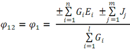

где число ветвей:   n -   с источниками ЭДС;  m -  с ИТ; l -  без ИТ

Знак узлового тока (справедлив и для метода узловых потенциалов): если источник ЭДС или тока в ветви направлен к узлу, обозначенному первой буквой индекса межузлового напряжения – узловой ток с (+), если от него – с (–).

Токи в ветвях определяются по закону Ома для активного (обобщенный закон Ома) или пассивного участков цепи с использованием межузлового напряжения.

#  22. Расчет цепей постоянного тока методом наложения.

Принцип суперпозиции является одним из важнейших физических принципов, отражающих основное свойство линейных систем – независимость действия возбуждающих сил.

Основанный на принципе суперпозиции метод наложения позволяет рассматривать воздействие нескольких источников энергии на данный элемент цепи как результат воздействия каждого из источников в отдельности.

При этом расчет сложной цепи с несколькими источниками ЭДС или тока сводится к расчету нескольких цепей с одним источником.

Ток любой ветви или напряжение любого участка можно найти как алгебраическую сумму частичных токов или напряжений, создаваемых действием отдельных источников ЭДС и тока.

Ветви с исключаемыми идеальными источниками ЭДС закорачиваются, источниками тока – размыкаются.

Ток ветви есть алгебраическая сумма частичных токов, возбуждаемых каждым источником в отдельности, т.е.  I1 = I1’ + I1” +  I1’”  и т.д.

#  23. Расчет цепей постоянного тока методом эквивалентного генератора.

Часто при анализе сложных цепей интересует состояние лишь одной ветви, причем параметры элементов этой ветви могут изменяться.

В этом случае целесообразно  воспользоваться методом эквивалентного генератора.

Суть метода в том, что по отношению к исследуемой ветви сложная цепь заменяется активным двухполюсником А, схема замещения которого представляется эквивалентным источником, нагрузкой для которого является сопротивление R исследуемой ветви.

Эквивалентный активный двухполюсник можно представить источником напряжения, ЭДС которого равна напряжению холостого хода на зажимах двухполюсника, а внутреннее сопротивление равно входному сопротивлению двухполюсника, из схемы которого устранены все источники (ветви с идеальными источниками ЭДС и источниками тока соответственно закорочены и разомкнуты).

Алгоритм расчета:

1.  задаемся направлением тока в  исследуемой ветви;
2.  составляем схему замещения в виде последовательного соединения эквивалентного активного двухполюсника и ветви с неизвестным током;
3.  определяем параметры эквивалентного активного двухполюсника (Eэ = Uхх , rэ = rвх);
4.  на основе II закона Кирхгофа (Ома для замкнутой цепи или активной ветви) записываем выражение для тока.

по обобщенному закону Ома  I = (Еэ – Е)/ (Rвх+R).

#  24. Расчет цепей постоянного тока методом эквивалентных преобразований источников энергии.

#  25. Принципы компенсации напряжения и тока. Потенциальная диаграмма цепи постоянного тока.

- Потенциальная диаграмма цепи постоянного тока - есть графическая иллюстрация II закона Кирхгофа; показывает распределение потенциала вдоль замкнутого контура
  
  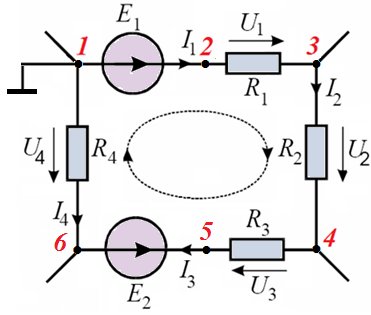

  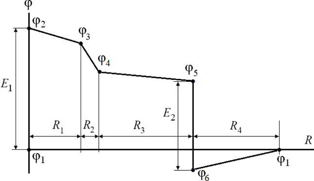

  $$ φ_1 = 0 \quad φ_4 = φ_3 – I_2R_2 $$
	$$φ_2 = Е_1 \quad φ_5 = φ_4 – I_3R_3 $$
	$$φ_3 = Е_1 – I_1R_1 \quad φ_6 = φ_5 – Е_2$$
  $$φ_1 = φ_6 + I_4R_4 = 0$$

- Принцип компенсации напряжения: ветвь 1-2  с напряжением U12 можно заменить эквивалентным источником ЭДС Е = U12 c противоположным направлением, что следует из II закона Кирхгофа, в котором любое слагаемое суммы напряжений можно перенести в другую часть уравнения с противоположным знаком.
- Принцип компенсации тока: ветвь 1-2  с током I1 можно заменить эквивалентным  ИТ J = I1 того же направления, что следует из I закона Кирхгофа для узлов 1-2.
  
  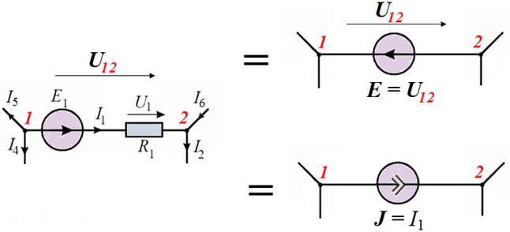

#  26. Баланс мощностей в цепи постоянного тока.

- Из закона сохранения энергии следует, что мощность источников питания в любой момент времени равна сумме мощностей, расходуемой на всех участках цепи
- В любой электрической цепи должен соблюдаться энергетический баланс – баланс мощностей: алгебраическая сумма мощностей всех источников энергии равна арифметической сумме мощностей всех приемников энергии.
  $$ \sum EI = \sum I^2R$$

#  27. Преимущества цепей переменного тока. Способы представления синусоидальных токов, напряжений, ЭДС.

- Аналитический способ:
  $$ i(t)=I_m\sin(\omega t + \phi_i)$$
  $$ u(t)=U_m\sin(\omega t + \phi_u)$$
  $$ e(t)=E_m\sin(\omega t + \phi_e)$$

- Временная диаграмма:
  - Временная диаграмма представляет графическое изображение синусоидальной величины в заданном масштабе в зависимости от времени
  $$ i(t)=I_m\sin(\omega t - \phi_i)$$

  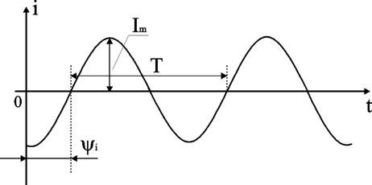

- Графоаналитический способ:
  - Графически синусоидальные величины изображаются в виде вращающегося вектора (рис. 2.2). Предполагается вращение против часовой стрелки с частотой вращения ω. Величина вектора в заданном масштабе представляет амплитудное значение. Проекция на вертикальную ось есть мгновенное значение величины. Совокупность векторов, изображающих синусоидальные величины (ток, напряжение, ЭДС) одной и той же частоты называют векторной диаграммой.  

  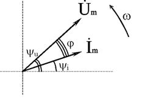

- Аналитический метод с использованием комплексных чисел:
  - Синусоидальный ток $i(t) = I_m \sin(\omega t + \phi)$ можно представить комплексным числом на комплексной плоскости, где амплитуда тока Im – модуль, а угол ψ, являющийся начальной фазой, – аргумент комплексного тока.

  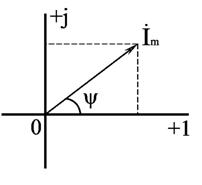

#  28. Действующее и среднее значения переменного тока.

- Для сравнения действий постоянного и переменного токов вводят понятие действующее значение переменного тока.

- Действующее значение переменного тока (RMS) -- количество мощности переменного тока, которое производит такой же нагревательный эффект, как эквивалентная мощность постоянного тока

  $$ Q_{ac} = \int_0^T i(t)Rdt = Q_{dc} = I^2RT$$

  $$ U = \sqrt{\frac{U_1^2+U_2^2+\ldots+U_n^2}{n}} = \frac{U_m}{\sqrt{2}} - \text{для синусоидальных величин}$$

#  29. Идеальная и реальная индуктивность в цепи переменного тока.

- $U_l = \frac{L di}{dt}$ -- Это соотношение является аналогом закона Ома для индуктивности. Конструктивно индуктивность выполняется в виде катушки с проводом.
- Катушка с проводом кроме свойства создавать магнитное поле обладает активным сопротивлением R

#  30. Идеальная и реальная емкость в цепи переменного тока.

- $U_c = \frac{1}{C \int i dt}$ -- Это соотношение является аналогом закона Ома для емкости.
- Конструктивно емкость выполняется в виде двух проводников разделенных слоем диэлектрика. Форма проводников может быть плоской, трубчатой, шарообразной и др

#  31. Закон Ома, 1-й и 2-й законы Кирхгофа в комплексной форме. Векторные диаграммы.

- $$ \dot{I} = \frac{\dot{U}}{Z}, \quad Z = \sqrt{R^2 + (X_L - X_C)^2}$$
- $$ \sum(\plusmn \dot{I}) = 0$$
- $$ \sum(\plusmn \dot{E}) = \sum(\plusmn \dot{I}Z) + \sum(\plusmn \dot{U})$$

#  32. Последовательное соединение R, L, C - элементов. Треугольники сопротивлений и напряжений.

#  33. Параллельное соединение R, L, C - элементов. Треугольники проводимостей и токов.

#  34. Смешанное соединение R, L, C - элементов. Векторная диаграмма цепи.

#  35. Мощность на резистивном элементе в цепи переменного тока.

- $$ p(t) = u(t) i(t) $$
- $$ P = UI$$
- Вт

#  36. Мощность на индуктивном элементе в цепи переменного тока. 

- $$ Q_L = I^2X_L = i L \frac{di}{dt}$$
- ВАр -- Вольт-Ампер реактивный

#  37. Мощность на емкостном элементе в цепи переменного тока.

- $$ Q_C = I^2X_C = u C \frac{du}{dt}$$
- ВАр -- Вольт-Ампер реактивный

#  38. Баланс мощностей в цепи переменного тока.

$$S_{src} = S_{pr}$$

#  39. Увеличение коэффициента мощности в цепи переменного тока.

Активная мощность потребителя определена формулой

$$P = U I cos φ$$

Величину cos φ здесь называют коэффициентом мощности. Ток в линии питающей потребителя с заданной мощностью Р равен

$$I = P / (U cos φ)$$

и будет тем больше, чем меньше cos φ. При этом возрастают потери в питающей линии. Для их снижения желательно увеличивать cos φ. Большинство потребителей имеет активно-индуктивную нагрузку. Увеличение cos φ возможно путем компенсации индуктивной составляющей тока путем подключения параллельно нагрузке конденсатора.

#  40. Резонанс напряжений. Частотные характеристики последовательного колебательного контура.

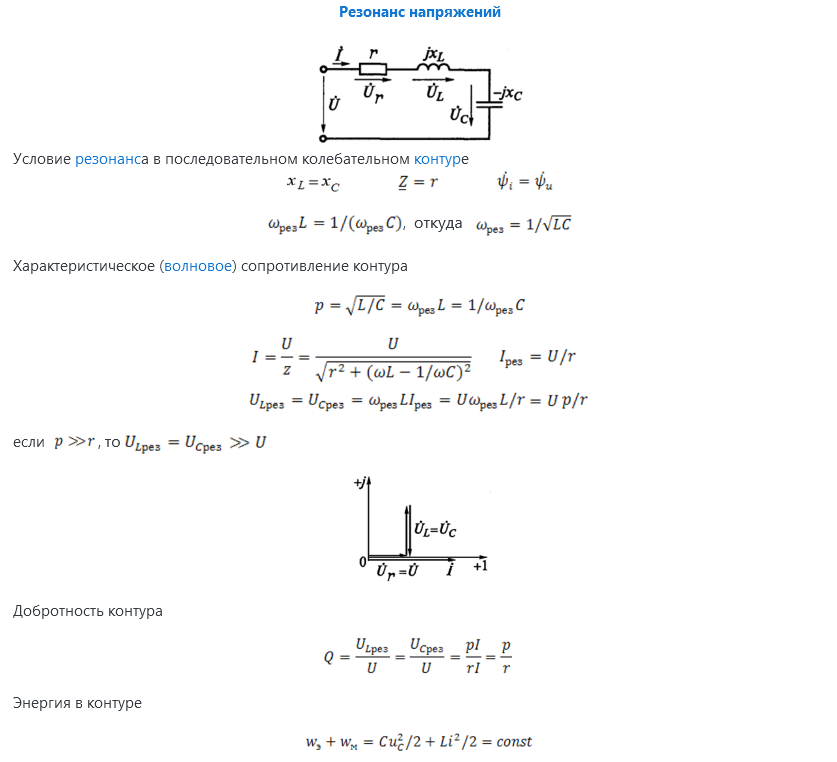

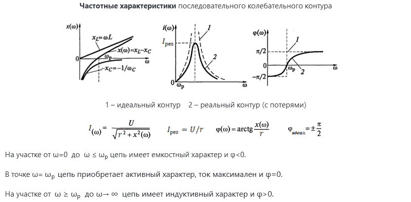

#  41. Резонанс токов. Частотные характеристики параллельного колебательного контура.

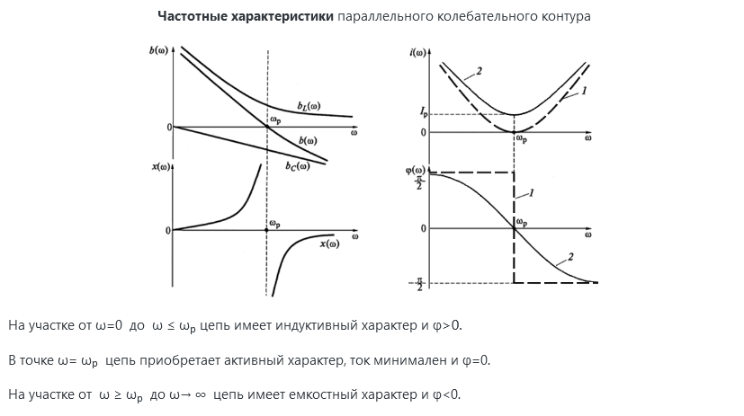

#  42. Линейные пассивные четырехполюсники. Основные определения. Параметры, характеристики.

- часть электрической цепи с двумя парами зажимов – входными и выходными, либо с двумя зажимами, если схема имеет «общий» провод для входа и выхода.

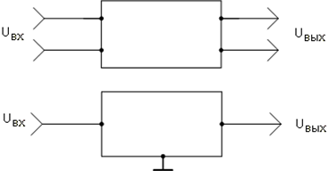

Ч делятся на активные (с источниками энергии) и пассивные; линейные (по признаку линейности входящих в Ч элементов) и нелинейные.

Линейные (ЛЧ) состоят из элементов, параметры которых не зависят от тока, напряжения, магнитного потока и заряда.

- Передаточная функция ЛЧ есть отношение комплексных амплитуд выходного и входного сигналов соответственно 

$$ K(j\omega) = \frac{U_{out}(j\omega)}{U_{in}(j\omega)} = K(\omega)e^{j\phi(\omega)}$$

где модуль К(ω) (коэффициент передачи) – амплитудно-частотная характеристика (АЧХ), аргумент φ(ω) – фазочастотная характеристика (ФЧХ).

АЧХ – зависимость отношения амплитуд выходного и входного сигналов от частоты. Часто выражается в логарифмических единицах – децибелах, для коэффициентов передачи по току и напряжению К [дБ] = 20lg(К), по мощности К [дБ] = 10lg(К).

ФЧХ – зависимость сдвига фаз между выходным и входным сигналами от частоты.

Переходная характеристика h(t) – отклик ЛЧ на входной испытательный сигнал в виде единичной функции 1(t – t0), представляющей собой скачок напряжения в момент времени t0.

#  43. Частотные фильтры. Принцип действия, основные параметры, классификация.

ЛЧ, пропускающий сигналы определенных частот с возможно малым затуханием, является частотным фильтром.

Принцип действия фильтров основан на зависимости реактивных сопротивлений фильтра – катушек индуктивности и конденсаторов, от частоты.

Полоса пропускания фильтра есть диапазон частот, в пределах которого АЧХ отличается от своего максимума не более, чем на 3 дБ (в √2 раз).

- Фильтры классифицируют по:

  - составу компонентов (LC - резонансные, RC - избирательные);
  - виду фильтруемых сигналов (аналоговые, цифровые);
  - схеме звеньев (Г-, П-, Т-образные);
  - пропускаемому диапазону частот:
    - низких - ФНЧ,
    - высоких - ФВЧ,
    - полосовые,
    - заградительные (режекторные).

#  44. Фильтр низких частот. Параметры, характеристики.

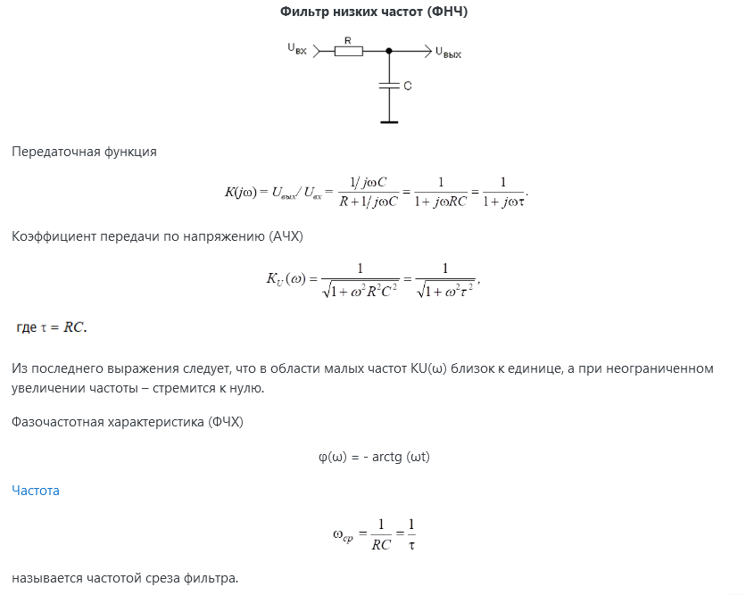

#  45. Фильтр верхних частот. Параметры, характеристики.

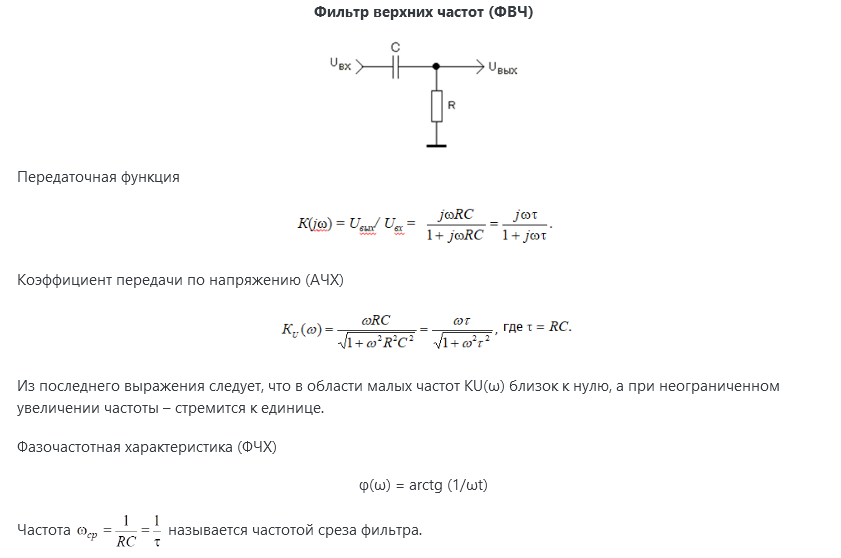

#  46. Преимущества трехфазных сетей. Трехфазный симметричный генератор.

Трехфазная цепь является частным случаем многофазных систем электрических цепей, представляющих собой совокупность электрических цепей, в которых действуют синусоидальные ЭДС одинаковой частоты, отличающиеся по фазе одна от другой и создаваемые общим источником энергии.

Каждую из частей многофазной системы, характеризующуюся одинаковым током, принято называть фазой. Таким образом, понятие "фаза" имеет в электротехнике два значения: первое – аргумент синусоидально изменяющейся величины, второе – часть многофазной системы электрических цепей. Цепи в зависимости от количества фаз называют двухфазными, трехфазными, шестифазными и т.п.

Трехфазные цепи – наиболее распространенные в современной электроэнергетике. Это объясняется рядом их преимуществ по сравнению как с однофазными, так и с другими многофазными цепями:
  -  экономичность производства и передачи энергии по сравнению с однофазными цепями;
  -  возможность сравнительно простого получения кругового вращающегося магнитного поля, необходимого для трехфазного асинхронного двигателя;
  -  возможность получения в одной установке двух эксплуатационных напряжений – фазного и линейного.

Трехфазная цепь состоит из трех основных элементов: трехфазного генератора, в котором механическая энергия преобразуется в электрическую с трехфазной системой ЭДС; линии передачи со всем необходимым оборудованием; приемников (потребителей), которые могут быть как трехфазными (например, трехфазные асинхронные двигатели), так и однофазными (например, лампы накаливания).

Трехфазный генератор представляет собой синхронную машину двух типов: турбогенератор и гидрогенератор. Модель трехфазного генератора схематически изображена на рис. 3.1.

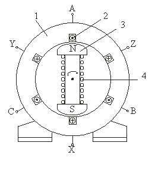

На статоре 1 генератора размещается обмотка 2, состоящая из трех частей или, как их принято называть, фаз. Обмотки фаз располагаются на статоре таким образом, чтобы их магнитные оси были сдвинуты в пространстве относительно друг друга на угол 2π/3, т.е. на 120°. На рис. 3.1 каждая фаза обмотки статора условно показана состоящей из одного витка. Начала фаз обозначены буквами A, B и C, а концы – X, Y, Z. Ротор 3 представляет собой электромагнит, возбуждаемый постоянным током обмотки возбуждения 4, расположенной на роторе.

#  47. Виды приемников трехфазной сети, способы соединения их с генератором.

#  48. Соединение фаз симметричного и несимметричного приемника 4-х-проводной звездой с ZN = 0.

#  49. Соединение фаз симметричного и несимметричного приемника 4-х-проводной звездой с ZN ≠ 0 и 3-х-проводной звездой.

#  50. Соединение фаз симметричного и несимметричного приемника треугольником.

#  51. Мощность симметричной трехфазной цепи. Мощность приемника при соединении его фаз звездой и треугольником.

#  52. Сравнение режимов работы приемника при соединении звездой и треугольником. Измерение активной мощности трехфазной цепи (методы 1-го, 2-х, 3-х ваттметров).

#  53. Переходные процессы. Основные понятия и определения, причины возникновения. Законы коммутации.

Под переходным (динамическим, нестационарным) процессом или режимом в электрических цепях понимается процесс перехода цепи из одного установившегося состояния (режима) в другое. При установившихся, или стационарных, режимах в цепях постоянного тока напряжения и токи неизменны во времени, а в цепях переменного тока они представляют собой периодические функции времени. Установившиеся режимы при заданных и неизменных параметрах цепи полностью определяются только источником энергии. Следовательно, источники постоянного напряжения (или тока) создают в цепи постоянный ток, а источники переменного напряжения (или тока) – переменный ток той же частоты, что и частота источника энергии.

Переходные процессы возникают при любых изменениях режима электрической цепи: при подключении и отключении цепи, при изменении нагрузки, при возникновении аварийных режимов (короткое замыкание, обрыв провода и т.д.). Изменения в электрической цепи можно представить в виде тех или иных переключений, называемых в общем случае коммутацией. Физически переходные процессы представляют собой процессы перехода от энергетического состояния, соответствующего до коммутационному режиму, к энергетическому состоянию, соответствующему после коммутационному режиму.

Переходные процессы обычно быстро протекающие: длительность их составляет десятые, сотые, а иногда и миллиардные доли секунды. Сравнительно редко длительность переходных процессов достигает секунд и десятков секунд. Тем не менее изучение переходных процессов весьма важно, так как позволяет установить, как деформируется по форме и амплитуде сигнал, выявить превышения напряжения на отдельных участках цепи, которые могут оказаться опасными для изоляции установки, увеличения амплитуд токов, которые могут в десятки раз превышать амплитуду тока установившегося периодического процесса, а также определять продолжительность переходного процесса. С другой стороны, работа многих электротехнических устройств, особенно устройств промышленной электроники, основана на переходных процессах. Например, в электрических нагревательных печах качество выпускаемого материала зависит от характера протекания переходного процесса. Чрезмерно быстрое нагревание может стать причиной брака, а чрезмерно медленное отрицательно оказывается на качестве материала и приводит к снижению производительности.

В общем случае в электрической цепи переходные процессы могут возникать, если в цепи имеются индуктивные и емкостные элементы, обладающие способностью накапливать или отдавать энергию магнитного или электрического поля. В момент коммутации, когда начинается переходный процесс, происходит перераспределение энергии между индуктивными, емкостными элементами цепи и внешними источниками энергии, подключенными к цепи. При этом часть энергия безвозвратно преобразуется в другие виды энергий (например, в тепловую на активном сопротивлении).

После окончания переходного процесса устанавливается новый установившийся режим, который определяется только внешними источниками энергии. При отключении внешних источников энергии переходный процесс может возникать за счет энергии электромагнитного поля, накопленной до начала переходного режима в индуктивных и емкостных элементах цепи.

Изменения энергии магнитного и электрического полей не могут происходить мгновенно, и, следовательно, не могут мгновенно протекать процессы в момент коммутации. В самом деле, скачкообразное (мгновенное) изменение энергии в индуктивном и емкостном элементе приводит к необходимости иметь бесконечно большие мощности p = dW/dt, что практически невозможно, ибо в реальных электрических цепях бесконечно большой мощности не существует.

Таким образом, переходные процессы не могут протекать мгновенно, так как невозможно в принципе мгновенно изменять энергию, накопленную в электромагнитном поле цепи. Теоретически переходные процессы заканчиваются за время t→∞. Практически же переходные процессы являются быстропротекающими, и их длительность обычно составляет доли секунды.

Первый закон коммутации состоит в том, что ток в ветви с индуктивным элементом в начальный момент времени после коммутации имеет то же значение, какое он имел непосредственно перед коммутацией, а затем с этого значения он начинает плавно изменяться. Сказанное обычно записывают в виде iL(0-) = iL(0+), считая, что коммутация происходит мгновенно в момент t = 0.

Второй закон коммутации состоит в том, что напряжение на емкостном элементе в начальный момент после коммутации имеет то же значение, какое оно имело непосредственно перед коммутацией, а затем с этого значения оно начинает плавно изменяться: UC(0-) = UC(0+).

Следовательно, наличие ветви, содержащей индуктивность, в цепи, включаемой под напряжение, равносильно разрыву цепи в этом месте в момент коммутации, так как iL(0-) = iL(0+). Наличие в цепи, включаемой под напряжение, ветви, содержащей разряженный конденсатор, равносильно короткому замыканию в этом месте в момент коммутации, так как UC(0-) = UC(0+).

Однако в электрической цепи возможны скачки напряжений на индуктивностях и токов на емкостях.

В электрических цепях с резистивными элементами энергия электромагнитного поля не запасается, вследствие чего в них переходные процессы не возникают, т.е. в таких цепях стационарные режимы устанавливаются мгновенно, скачком.

В действительности любой элемент цепи обладает каким-то сопротивлением r, индуктивностью L и емкостью С, т.е. в реальных электротехнических устройствах существуют тепловые потери, обусловленные прохождением тока и наличием сопротивления r, а также магнитные и электрические поля.

Переходные процессы в реальных электротехнических устройствах можно ускорять или замедлять путем подбора соответствующих параметров элементов цепей, а также за счет применения специальных устройств.

#  54. Классический метод расчета переходных процессов.

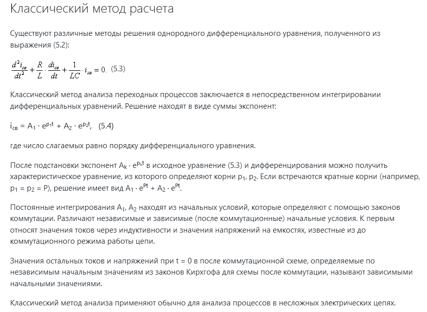

#  55. Переходный процесс при заряде емкости от источника постоянной ЭДС.

#  56. Переходный процесс при разряде емкости через резистор.

#  57. Переходный процесс при подключении RL-цепи к постоянной ЭДС.

#  58. Переходный процесс при коротком замыкании RL-цепи с током.

#  59. Переходные процессы при подключении RLС-цепи к постоянной ЭДС. Варианты процессов.

#  60. Апериодический (критический) переходный процесс при подключении RLС-цепи к постоянной ЭДС.

#  61. Колебательный переходный процесс при подключении RLС-цепи к постоянной ЭДС.

#  62. Методика расчета переходных процессов операторным методом.
