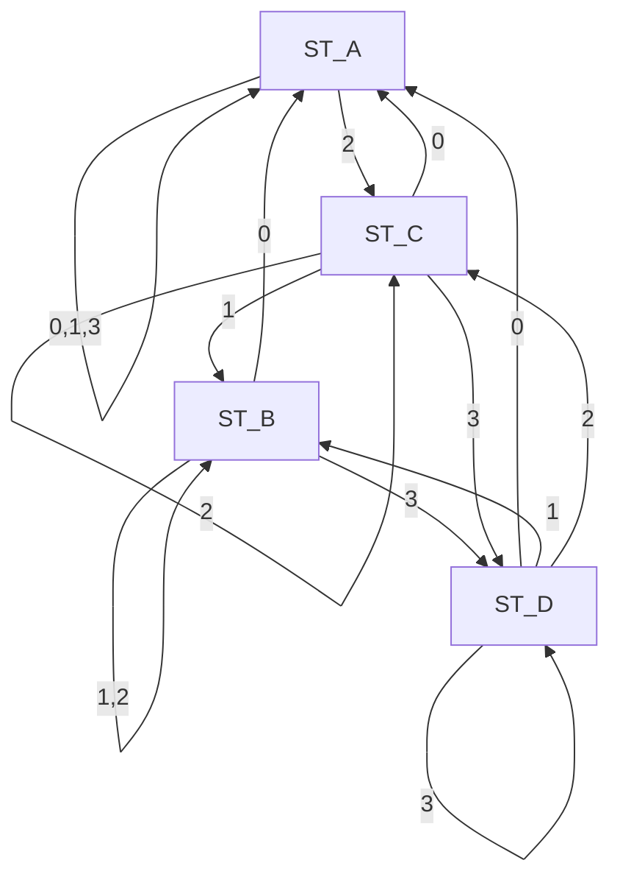

```python
ADFF = 0b1010.1101.1111.1111
```

|      | ST_A | ST_B | ST_C | ST_D |
|------|------|------|------|------|
| ST_A | 1    | 0    | 1    | 0    |
| ST_B | 1    | 1    | 0    | 1    |
| ST_C | 1    | 1    | 1    | 1    |
| ST_D | 1    | 1    | 1    | 1    |



A(0) - A(1) - A(3) - C(2) - C(2) - D(3) - D(3) - B(1) - B(1) - B(2) - D(3) - C(2) - A(0) - C(2) - B(1) - A(0) - C(2) - D(3) - A(0)